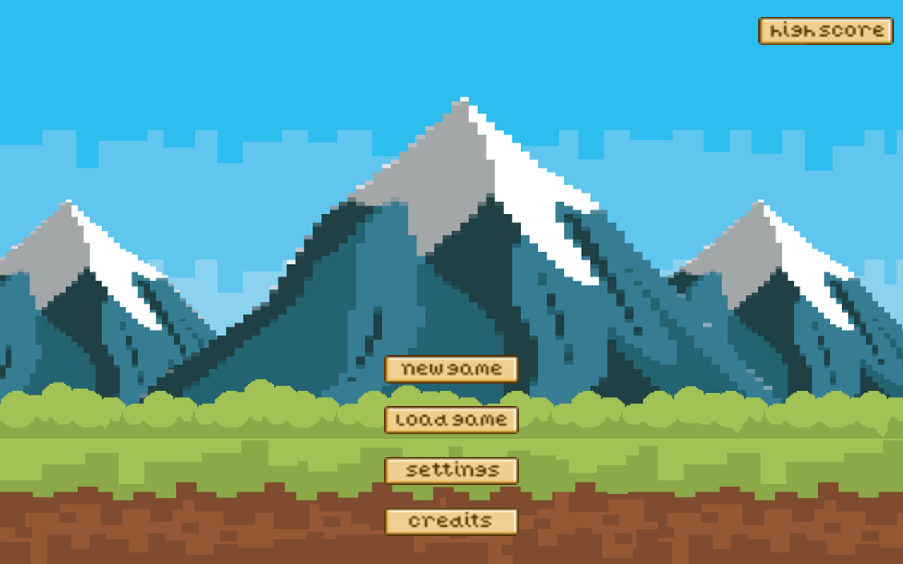
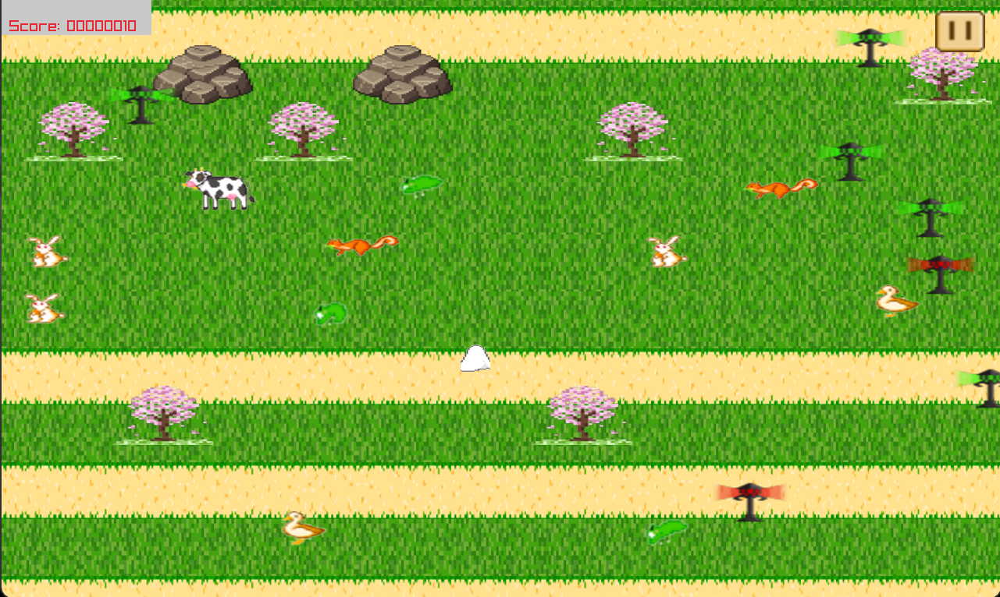
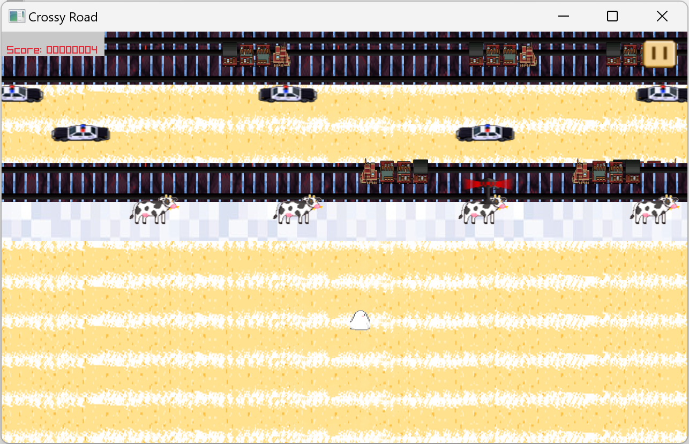

# Run 4 Ur Life
<!-- 

 -->

## Table of content 
- Description
- Contributors
- Dependencies
- Installation Guide
- Usage
- Features
- Documentation

## Description 

*Run 4 Ur Life* belongs to the category of games commonly known as "endless runners" or "infinite runners." Featuring 5 levels of difficulties ranging from Easy to Nightmare, our game presents a fun and sufficiently challenging means of passing time. In *Run 4 Ur Life*, players control the main character as they attempt to cross roads, rivers, and other obstacles; for every mode of difficulty, the speed at which obstacles move will be increased and themes will be changed accordingly.

### Demonstration

- video

## Contributors
- Lê Quốc Văn - @qvanle
- Dương Minh Quang - @DuongMQuang
- Lâm Tú Nhi - @fragilember
- Trần Quang Huy - @TranQuangHuy2004

## Dependencies
### Required
- GCC 13+ (or clang 15+)
- Cmake 
- build system (makefile, ninja etc)
- mesa packet (optional for mac and linux)
### Automated downloads
- Raylib
- cppyaml
### Other 
- doxygen 
- git 

## Installation Guide 

### Install GCC
- For Linux:
On most Linux distributions, GCC can be installed using the package manager. Open a terminal and run the following commands based on your package manager:
    - Debian/Ubuntu:
        <code>sudo apt update</code>
        <code>sudo apt install gcc</code>
    - Red Hat/Fedora:
        <code>sudo dnf install gcc</code>

- For macOS:
On macOS, you can use *Homebrew* to install GCC. First, make sure you have Homebrew installed. If not, you can install it from https://brew.sh/. Once Homebrew is installed, open a terminal and run:
    <code>brew install gcc</code>

- For Windows:
On Windows, you can use *MinGW* (Minimalist GNU for Windows) or *MSYS2* to install GCC.
    - MinGW:
        1. Download the MinGW installer from https://mingw-w64.org/doku.php.
        2. Run the installer and follow the on-screen instructions.
        3. During installation, select the components including the "gcc" compiler.
    - MSYS2:
        1. Download the MSYS2 installer from https://www.msys2.org/.
        2. Run the installer and follow the on-screen instructions.
        3. Open the MSYS2 terminal and run:
        <code>pacman -S mingw-w64-x86_64-gcc</code>

- Verification:
To verify that GCC is installed, open a terminal (or command prompt on Windows) and type: <code>gcc --version</code>
This should display information about the installed GCC version.

### Install Cmake 
- For Linux:
On most Linux distributions, you can use the package manager to install CMake. Open a terminal and run the following commands based on your package manager:
    - Debian/Ubuntu:
        <code>sudo apt update</code>
        <code>sudo apt install cmake</code>
    - Red Hat/Fedora:
        <code>sudo dnf install cmake</code>

- For macOS:
On macOS, you can use *Homebrew* to install CMake. If you don't have Homebrew installed, you can get it from https://brew.sh/. Once Homebrew is installed, open a terminal and run:
    <code>brew install cmake</code>

- For Windows:
On Windows, you can download the installer from the official CMake website:
    1. Visit https://cmake.org/download/ in your web browser.
    2. Download the Windows Installer.
    3. Run the installer and follow the on-screen instructions.

- Verification:
To verify that CMake is installed, open a terminal or command prompt and type: <code>cmake --version</code>
This should display information about the installed CMake version.

- Install build system 
- Download file from github: https://github.com/qvanle/Crossy-Road
- Run build.bat (build.sh for Mac and Linux)

## Usage 
### Gameplay 

### Save & load 
[Save & load](https://youtu.be/-8zYW2Oad_o)

### Highscores 

### Resize 

## Features 
- [x] Basic requirement
- [x] Menu
- [x] Save game and Load game
- [x] Traffic lights
- [x] Collision effects
- [x] Game levels: at least 5
- [x] Main character resources
- [x] Vehicle resources
- [x] Animal resources
- [x] Other special effects
- [x] Bonus feature (max 0.5 point) : Highscores
- [x] Bonus feature (max 0.5 point) : Resize 
- [x] Bonus feature (max 0.5 point) : 5 themes 
- [x] Bonus feature (max 0.5 point) : Musics

## Documentation 
- [Report]()
- [Contribution](https://docs.google.com/spreadsheets/d/1AVUBVkAyLRs_uJDbkoPnMfpPMAuqWG7FugoVfJgquLs/edit?usp=sharing)
- [Grading scheme](https://docs.google.com/spreadsheets/d/1jVbS3Elh6-2IouKZW_RCUDCNzjiY3pcXCJgKksatuZs/edit?usp=sharing)
- [Video demo]()

